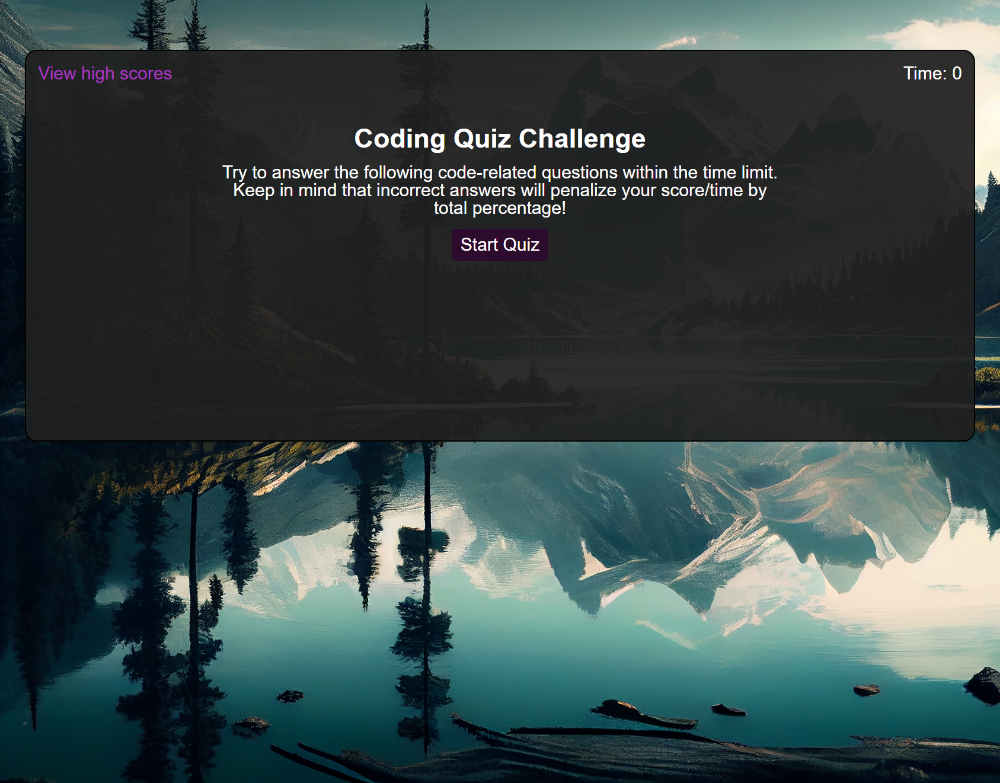
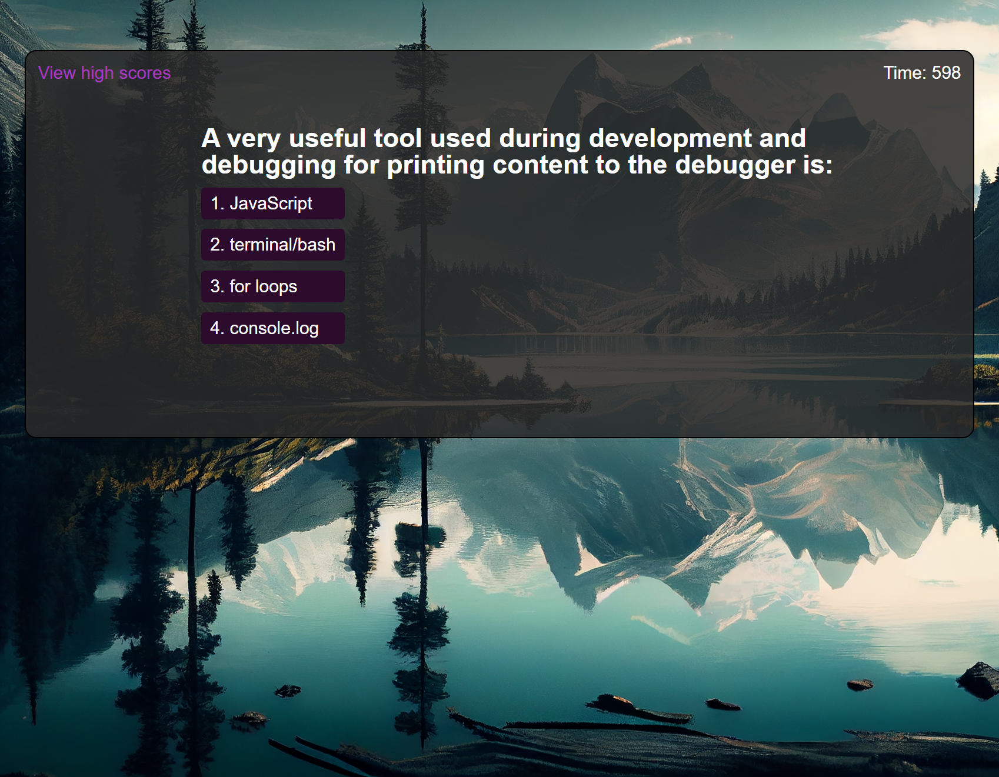
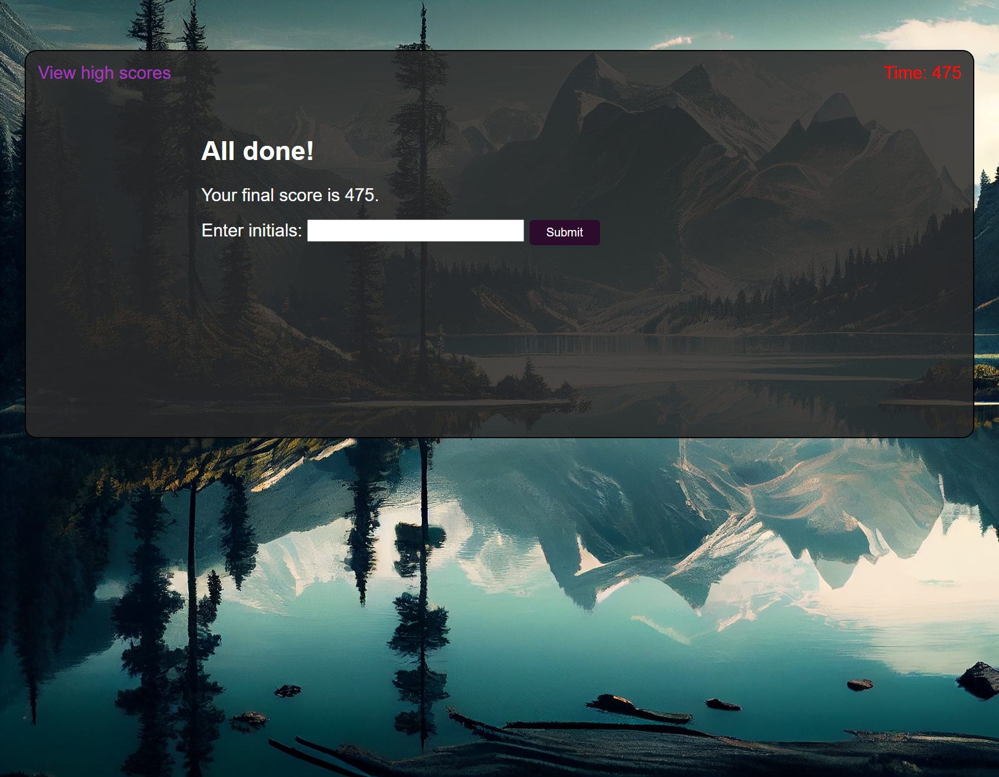
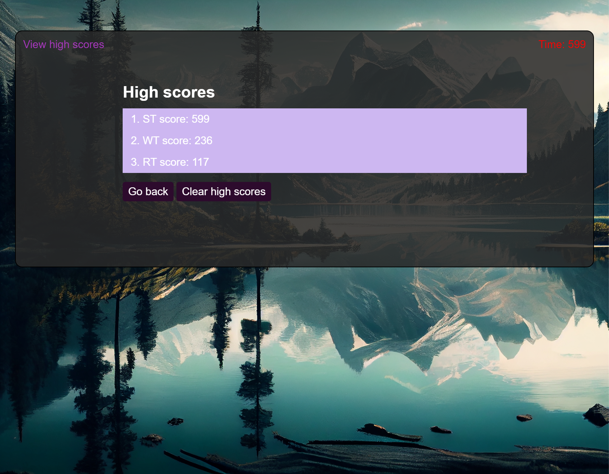

# Coding-Quiz

## Description

A quiz to test your knowledge about JavaScript. 
## Deployed Application

Click [here](https://sareacct91.github.io/Coding-Quiz/) to access the deployed application.

## Usage

Starting/Landing page of the application.

  

The quiz begins after you click the Start Quiz button.
you have 10 mins to answer all the questions. If you picked the wrong answer, a percentage of the total time will be subtracted from the remaining time.

  

When you finish the quiz or the time ran out. You'll see your score and a textbox to input your name/initial to submit to the score list.

  

Displying the scores from higest to lowest.

  

## Features

    Responsive Site design.
    keep track of your scores

## Credits

background image: [Image by vecstock on Freepik](https://www.freepik.com/free-photo/painting-mountain-lake-with-mountain-background_40965130.htm#query=nature&position=2&from_view=keyword&track=sph)